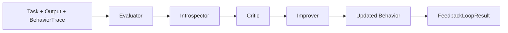

# Evaluation Introspection Agents

> **Most agents act. Few agents inspect themselves. This repo explores the missing loop: evaluation, introspection, critique, and behavioral improvement.**

A deterministic, dependency-light AI agents portfolio project for building agents that evaluate their own behavior, inspect traces, critique weaknesses, and propose better next actions — without any LLM API dependency yet.

## Why this matters

Agent systems need more than action generation. They need a visible correction loop:

- Did the output satisfy the objective?
- What steps produced it?
- What was weak, vague, risky, or incomplete?
- What should change on the next attempt?

This repository makes that loop explicit, testable, and reproducible.

## Architecture



```text
Task + Output + Trace
        |
        v
Evaluator Agent      -> score + objective alignment
        |
        v
Introspector Agent   -> trace summary + reasoning/debug notes
        |
        v
Critic Agent         -> weaknesses + vague terms + risks + failure modes
        |
        v
Improver Agent       -> recommendation + improved next draft
        |
        v
Readable / JSON report
```

## Core concepts

1. **Evaluator Agent**: scores an output against a task objective.
2. **Introspector Agent**: explains what happened internally using a behavior trace.
3. **Critic Agent**: identifies weaknesses, missing constraints, vague statements, risks, and failure modes.
4. **Improver Agent**: proposes a better next action and a deterministic improved draft.
5. **Feedback Loop**: connects evaluation → introspection → critique → improvement.

## Quickstart

```bash
git clone https://github.com/aditya89bh/Evaluation-Introspection-Agents.git
cd Evaluation-Introspection-Agents
python -m venv .venv
source .venv/bin/activate
pip install -e ".[dev]"
pytest
```

## Run demos

```bash
python demos/introspection_demo.py
python demos/critic_demo.py
python demos/improvement_demo.py
python demos/full_feedback_loop_demo.py
```

## CLI usage

Readable output:

```bash
evaluation-agents run examples/planning_task.json
```

JSON output:

```bash
evaluation-agents run examples/planning_task.json --json
```

## Example output

```text
Task: Create a project plan with owner, timeline, and rollback.
Score: 0.00
Evaluation: Matched 0 of 3 expected objective terms.
Introspection: The trace shows 2 recorded steps: parse, draft.
Critique:
- Missing expected terms: owner, timeline, rollback.
- Missing constraints: owner, timeline, rollback.
- Vague statements detected: some, things, maybe.
- Failure mode: low objective coverage may cause task failure.
Improvement: Include the missing objective terms (owner, timeline, rollback) and remove irrelevant detail.
```

## Benchmark

```bash
python benchmarks/run_benchmark.py
```

Current deterministic benchmark summary:

```json
{
  "average_score": 0.34,
  "case_count": 4,
  "failure_count": 15,
  "improvement_rate": 1.0,
  "pass_rate": 0.0
}
```

## Repository map

```text
src/evaluation_introspection_agents/
  agents/      evaluator, introspector, critic, improver
  core/        task, trace, result models, feedback loop
  cli.py       evaluation-agents command

demos/         runnable demos
examples/      JSON task library
benchmarks/    deterministic benchmark harness
docs/          architecture and roadmap
RESULTS.md     sample outputs and benchmark notes
```

## Roadmap

- Add richer deterministic scoring strategies.
- Add trace comparison across repeated attempts.
- Add configurable critique policies.
- Add report export formats.
- Add optional LLM-backed agents behind clean interfaces.
- Add examples for coding, research, planning, robotics, and support workflows.

## Portfolio positioning

This project is built to show practical AI-agent engineering judgment: evaluation loops, trace inspection, critique, error analysis, deterministic testing, CLI usability, benchmark reporting, and release discipline. It is intentionally simple now so the architecture is easy to inspect before adding heavier agent integrations later.
