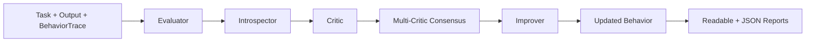
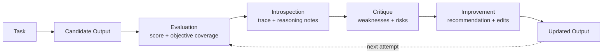
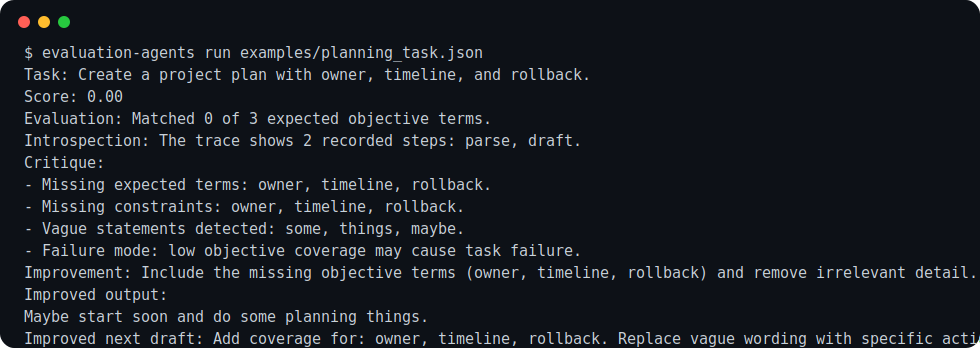

# Evaluation Introspection Agents


> **Most agents act. Few agents inspect themselves. This repo explores the missing loop: evaluation, introspection, critique, and behavioral improvement.**

A deterministic, dependency-light AI agents portfolio project for building agents that evaluate their own behavior, inspect traces, critique weaknesses, compare multiple critics, and propose better next actions — without any external LLM API dependency.

## v0.2 highlights

- Coverage reporting with a 90% CI quality gate.
- CLI demo assets and terminal-style screenshots.
- Expanded 20-case benchmark corpus across planning, safety, support, robotics, and reasoning.
- Category-aware benchmark metrics, Markdown reports, CSV export, and leaderboard.
- Multi-critic evaluation with deterministic consensus.
- Critique confidence, severity, and importance scoring.
- Critic disagreement analysis.
- Results dashboard: `results/latest.json`, `results/latest.md`, `results/latest.csv`.

## Why this matters

Agent systems need more than action generation. They need a visible correction loop:

- Did the output satisfy the objective?
- What steps produced it?
- What was weak, vague, risky, or incomplete?
- Do multiple critics agree?
- What should change on the next attempt?

This repository makes that loop explicit, testable, and reproducible.

## Architecture



## Feedback loop



## Screenshots and assets

### CLI demo



- [Readable CLI output](assets/demo/cli_readable_output.txt)
- [JSON CLI output](assets/demo/cli_json_output.txt)

### Benchmark demo


- [Benchmark Markdown report](results/benchmark_report.md)
- [Benchmark CSV report](results/benchmark_report.csv)
- [Latest dashboard](results/latest.md)

## Core concepts

1. **Evaluator Agent**: scores an output against a task objective.
2. **Introspector Agent**: explains what happened internally using a behavior trace.
3. **Critic Agent**: identifies weaknesses, missing constraints, vague statements, risks, and failure modes.
4. **Multi-Critic Evaluator**: compares deterministic critics and reports consensus/disagreement.
5. **Improver Agent**: proposes a better next action and a deterministic improved draft.
6. **Feedback Loop**: connects evaluation → introspection → critique → improvement.

## Quickstart

```bash
git clone https://github.com/aditya89bh/Evaluation-Introspection-Agents.git
cd Evaluation-Introspection-Agents
python -m venv .venv
source .venv/bin/activate
pip install -e ".[dev]"
pytest --cov=evaluation_introspection_agents --cov-fail-under=90
```

## Run demos

```bash
python demos/introspection_demo.py
python demos/critic_demo.py
python demos/improvement_demo.py
python demos/full_feedback_loop_demo.py
```

## CLI usage

Readable output:

```bash
evaluation-agents run examples/planning_task.json
```

JSON output:

```bash
evaluation-agents run examples/planning_task.json --json
```

## Benchmark

```bash
python benchmarks/run_benchmark.py
```

Current deterministic benchmark summary:

```json
{
  "average_score": 0.02,
  "case_count": 20,
  "failure_count": 74,
  "improvement_rate": 1.0,
  "pass_rate": 0.0
}
```

The benchmark intentionally starts from weak candidate outputs. The important signal is that the loop identifies problems deterministically and produces improved drafts with complete expected-term coverage.

## Repository map

```text
src/evaluation_introspection_agents/
  agents/      evaluator, introspector, critic, multi-critic, improver
  core/        task, trace, result models, feedback loop
  cli.py       evaluation-agents command

demos/         runnable demos
examples/      JSON task library
benchmarks/    deterministic benchmark harness + 20 scenarios
assets/        CLI and benchmark visual assets
results/       benchmark reports and latest dashboard
docs/          architecture, benchmarking, roadmap
```

## Roadmap

- Add richer deterministic scoring strategies.
- Add trace comparison across repeated attempts.
- Add configurable critique policies.
- Add benchmark trend tracking across releases.
- Add optional LLM-backed agents behind clean interfaces.
- Add examples for coding, research, planning, robotics, and support workflows.

## Portfolio positioning

This project demonstrates practical AI-agent engineering judgment: evaluation loops, trace inspection, critique, multi-critic analysis, error analysis, deterministic testing, CLI usability, benchmark reporting, release discipline, and CI quality gates. It is intentionally simple and inspectable before adding heavier agent integrations later.
