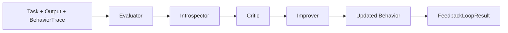

# Architecture

The repository models a deterministic feedback loop for AI-agent behavior. The loop keeps each stage inspectable before introducing any optional LLM-backed implementation.

## System diagram



## Data flow

```mermaid
sequenceDiagram
    participant User
    participant CLI
    participant Loop as FeedbackLoop
    participant Eval as EvaluatorAgent
    participant Intro as IntrospectorAgent
    participant Critic as CriticAgent
    participant Improve as ImproverAgent

    User->>CLI: evaluation-agents run task.json
    CLI->>Loop: Task + output + trace
    Loop->>Eval: evaluate output
    Eval-->>Loop: EvaluationResult
    Loop->>Intro: inspect BehaviorTrace
    Intro-->>Loop: IntrospectionResult
    Loop->>Critic: analyze weaknesses and risks
    Critic-->>Loop: CritiqueResult/findings
    Loop->>Improve: produce better next draft
    Improve-->>Loop: ImprovementResult
    Loop-->>CLI: readable or JSON report
```

## Components

- `Task`: stores the objective and expected terms.
- `BehaviorTrace`: stores observable steps from the agent run.
- `EvaluatorAgent`: scores objective coverage.
- `IntrospectorAgent`: summarizes trace behavior.
- `CriticAgent`: identifies weaknesses, vague statements, risks, constraints, and failure modes.
- `ImproverAgent`: proposes a better next action and deterministic improved draft.
- `FeedbackLoop`: orchestrates the components into one report.

## Design principles

- Deterministic first.
- Dependency-light.
- Easy to test.
- Inspectable at every stage.
- Optional LLM integrations should remain behind clean interfaces later.
