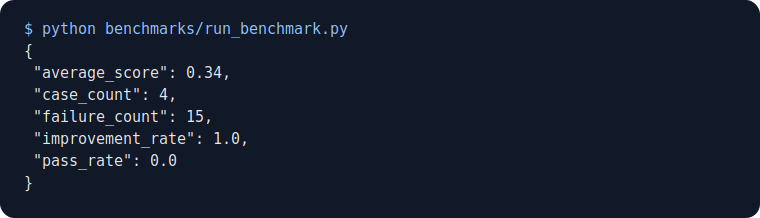

# Benchmarking

Run the deterministic benchmark suite with:

```bash
python benchmarks/run_benchmark.py
```

The current assets include:

- `assets/benchmarks/benchmark_metrics_output.txt`
- `assets/benchmarks/benchmark_report_example.json`
- `assets/benchmarks/benchmark_terminal_screenshot.svg`


